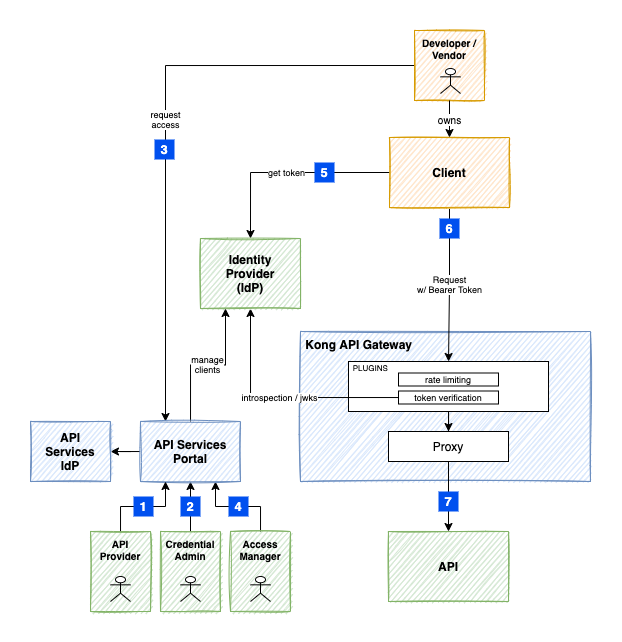

# Protecting an API with OAuth2 Client Credential Flow

Steps for protecting and calling an API using the OAuth2 Client Credential Grant.

1. Configuring an API on the Kong Gateway
2. Granting Access to the IdP
3. Client Requesting Access
4. Provider Approving Access
5. Client Retrieving the Access Token
6. Client Calling an API
7. Gateway Proxying to Upstream



## 1. Configuring an API on the Kong Gateway

The API Provider User Journey document provides the steps to enable a new API on the Kong Gateway. It will walk you through the creation of a new Namespace, and a Service Account that can be used to configure the Kong Gateway and the Authorization Profile described in step 2.

Once the API is working on the Gateway, you can then define a Product, which can be made available on the API Services Portal Directory.

## 2. Granting Access to the IdP

### a) Prerequisites

Before the Portal can be configured, a new set of credentials must be created on the IdP. For this tutorial, we will include the steps when Keycloak is the IdP.

**Create a new Client on the IdP**

Create a new client with Access Type `confidential`. All flows except `Service Accounts` should be turned off.

Make a note of the `Client ID` and `Client Secret` , they will be used when the Portal `Authorization Profile` is created.

The `Full Scope Allowed` can be turned off and the `realm-management` client roles for `manage-clients` and `manage-users` should be added.

Add the `manage-clients` and `manage-users` client roles to the `Service Account Roles`.

### b) Setup the Authorization Profile

A credential with `CredentialIssuer.Admin` is required to update Authorization Profiles (`CredentialIssuer`).

Authorization Profiles can be setup either via the Portal or by using a Service Account with the Portal Directory API.

Update the below `CredentialIssuer` to include the environment details and the Scopes and Roles setup for authorization.

```
kind: CredentialIssuer
name: Resource Server Example
namespace: $NS
description: Authorization Profile for protecting Ministry of XYZ
flow: client-credentials
mode: auto
authPlugin: jwt-keycloak
clientAuthenticator: client-secret
clientRoles: []
clientMappers:
  - name: audience
    defaultValue: ''
availableScopes: [Function1/read, Function2/*, Function3/write, Function3/read]
owner: <your-username>
environmentDetails:
  - environment: prod
    issuerUrl: https://auth-issuer
    clientId: testapp-client
    clientRegistration: managed
    clientSecret: ""
```

### c) Link the Authorization Profile to the Product

Before making the API available on the Directory, the API should be configured with a plugin for protecting access. To do this, an API Provider can edit the Product details to select `Oauth2 Client Credential Flow` and the newly created Authorization Profile.

### d) Update your Gateway Configuration with the Plugin

Update your Gateway Configuration to include the `jwt-keycloak` plugin.

> HINT: When you configure the Product Environment, a `Plugin Template` will be displayed - this can be a starting point for protecting your API on the Gateway.

Finally, from the Portal, `enable` the Environment to make it available on the API Directory.

### e) Optional Configuration

**Scopes**

If you have Client Scopes that you want to have controlled by the Portal, add them to the Realm's `Client Scopes` and `Default Client Scopes` on the IdP.

Update the `CredentialIssuer` record above to match the `availableScopes` with the ones added on the IdP.

**Roles**

If you have Roles that you want to have controlled by the Portal, add them to the Client's `Roles`.

Update the `CredentialIssuer` record above to match the `clientRoles` with the ones added on the IdP.

**Client Mappers**

The `audience` is an optional mapper that can be added to a Client.

The IdP needs to have a policy that allows Audience to be added as a Protocol Mapper to the client.

In Keycloak, this is updated under the Realm's `Client Registration` -> `Client Registration Policies`.

Edit the Authenticated Access Policies -> Allowed Protocol Mapper Types to include the `oidc-audience-mapper`.

**UMA2 Authorization Resources**

If you want to use the Authorization services, then set `Authorization Enabled` to `ON` for the Client on the IdP. You will also want to set the `Decision Strategy` to `Affirmative`.

Update the following `CredentialIssuer` attributes:

```
  resourceType: ""
  resourceAccessScope: ""
  resourceScopes: []
```

- `resourceType`: The Resource Type of the resources that will be managed (required)
- `resourceScopes`: A list of the Authorization Scopes managed for the particular Resources (required)
- `resourceAccessScope`: Used in the case where the Resource Server owns all the resources, a user must have the `resourceAccessScope` assigned in order to be allowed to manage the access. If it is not set, then the user has to be the resource owner in order to manage access.

> `resourceAccessScope` - The API Services Portal has not completed the implementation for the scenario where the User is the Resource Owner (`resourceAccessScope` is left blank). It uses the `Token Exchange` capability but it's an optional service available on Keycloak and has numerous caveats around it. Please contact the APS team if interested to know more.

## 3. Client Requesting Access

Request access to the API via the API Services Portal and generate the credentials to be used below.

The Portal will use the credentials setup in the Authorization Profile, to create a disabled Client on the IdP (with any applicable Client Mappers) and return the credentials to the Requesting user.

## 4. Provider Approving Access

An Access Manager reviews the access request, sets any additional controls, grants the relevant permissions (i.e./ scopes and roles), and approves. The Portal will enable the Client and apply the permissions on the IdP.

The Portal sends a notification to the Requester letting them know that API Access has been approved (or rejected).

## 5. Client Retrieving the Access Token

Using the Credentials generated in step 3, the Requester calls the Token endpoint to get a new JWT token.

```
export CID=""
export CSC=""
export URL=""

curl $URL \
  -X POST -H "Content-Type: application/x-www-form-urlencoded" \
  -d client_id=$CID -d client_secret=$CSC \
  -d grant_type=client_credentials \
  -d scopes=openid
```

## 6. Client Calling the API

Extract the Access Token from the response, set it in a `TOK` environment variable, and call the API.

```
curl -v -H "Authorization: Bearer $TOK" \
  https://myservice.api.gov.bc.ca/v1/status
```

The API Gateway's `jwt-keycloak` plugin will use the IdP's public keys to validate the token and depending on the plugin configuration, validate the scopes or roles.

## 7. Gateway Proxying to Upstream

A technical, but important step in the integration is the Gateway proxying the request to the Upstream Service API and deciding on the different options for securing that interaction.

Options:

- `Network Policy` : If the Services are co-located on the same Cluster as the Gateway's Data Plane, then native network policies can be used to protect the channel between the Gateway and the Upstream Service. This approach is used for Services running on the Openshift Silver cluster.

- `Kong Upstream JWT`: This plugin adds a signed JWT to the request headers so that the Upstream Service can verify that the request came specifically from the Gateway.

- `Client Certificates` : Client certificates (mTLS) provides a way for the Upstream Service to provide a secure channel from the Gateway and to verify that the request came specifically from the Gateway.

- `Firewall IP Restrictions` : This provides a low-level of protection by limiting the IPs to the ones of the Gateway Data Planes. Because the Data Planes are typically on shared infrastructure, this would still allow traffic from other tenants. This might be acceptable based on the type of data delivered by or to the Upstream Service.

## Variations

### Signed JWT

The Authorization Profile `clientAuthenticator` was set to `client-secret` in this tutorial, but there is an alternate setup that can be used:

- `client-jwt-jwks-url` (Signed JWT with JWKS URL)

In this scenario, when a Client is requesting access, they will be required to enter a public URL that holds the public key information for a key pair that will be used in step 5 when retrieving the Bearer Token. For further details, you can see the specific example `intro-signed-jwt.md`.
